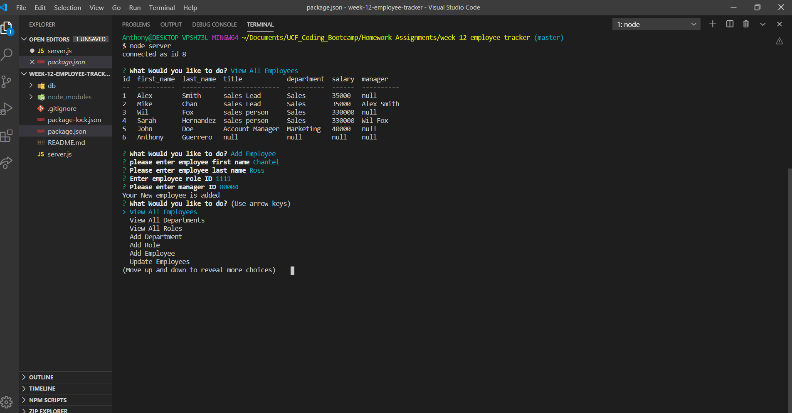

# week-12-employee-tracker

## Description: 
```
You'll be able to keep track of your employees by 
sorting them out by first & last name, title, department name, employee id, or salary.
```

# User story 
```
 As a business owner
I want to be able to view and manage the departments, roles, and employees in my company
So that I can organize and plan my business
```

## Screenshot of App

;


## To build this Application :
The package that I downloaded were Mysql, inquirer, and console.table to run this app. 
